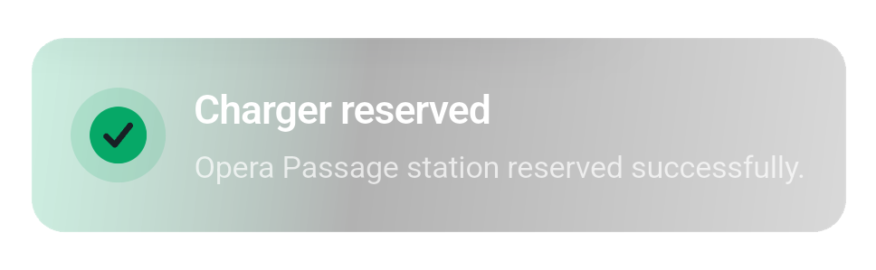
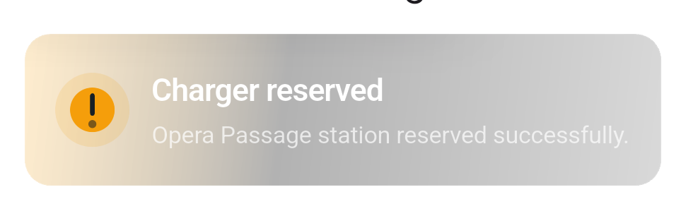
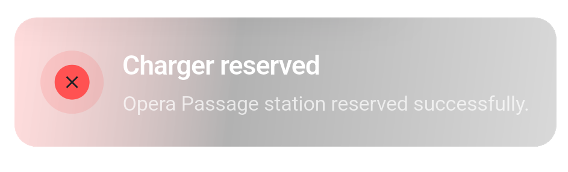

# Toasti 🍞

A beautiful, highly customizable, premium iOS-style glassmorphism toast overlay for Flutter.

---

## Features ✨

- **Glassmorphism Design** — High-quality frosted glass blur effect natively built for a premium look.
- **Animated Icons** — Built-in, meticulously crafted animations for `success`, `warning`, and `error` states.
- **Global Overlay** — Use `showToasti()` from anywhere in your app to display the toast on top of everything.
- **Entry Animation** — Smooth slide-in from the top with spring bounce, fade, and scale — plus a mirrored slide-out on dismiss.
- **Interactive** — Built-in swipe-up-to-dismiss gesture support.
- **Highly Customizable** — Override background color, text styles, width, and toggle animations on or off.
- **Responsive** — Automatically scales layout, typography, and icons for smaller screens.

---

## Screenshots 📸

<p align="center">
  
  
  
</p>

---

## Installation 💻

Add the package to your `pubspec.yaml`:

```yaml
dependencies:
  toasti_overlay: ^1.0.0
```

Then run:

```bash
flutter pub get
```

---

## Usage 🚀

Import the package wherever you want to trigger the toast:

```dart
import 'package:toasti_overlay/toasti.dart';
```

Call `showToasti()` from any button, event, or callback:

```dart
ElevatedButton(
  onPressed: () {
    showToasti(
      context,
      title: 'Charger reserved',
      description: 'Opera Passage station reserved successfully.',
      type: ToastType.success,
      duration: const Duration(seconds: 4),
    );
  },
  child: const Text('Show Success Toast'),
),
```

---

## Toast Types 🎨

Toasti ships with three distinct animated states:

| Type                | Animation                                         |
| ------------------- | ------------------------------------------------- |
| `ToastType.success` | Checkmark strokes itself edge-to-edge             |
| `ToastType.warning` | Exclamation line draws downward, dot blinks after |
| `ToastType.error`   | Circle continuously pulses in and out             |

---

## Parameters ⚙️

### `showToasti()`

| Parameter          | Type           | Default  | Description                                             |
| ------------------ | -------------- | -------- | ------------------------------------------------------- |
| `context`          | `BuildContext` | required | Build context used to insert the overlay                |
| `title`            | `String`       | required | Bold headline text                                      |
| `description`      | `String`       | required | Subtitle / body text                                    |
| `type`             | `ToastType`    | required | `success`, `warning`, or `error`                        |
| `duration`         | `Duration`     | `3s`     | How long the toast stays visible before auto-dismissing |
| `topOffset`        | `double`       | `56`     | Distance (dp) below the status bar                      |
| `horizontalMargin` | `double`       | `16`     | Side padding used to compute available width            |
| `backgroundColor`  | `Color?`       | `null`   | Overrides the default glassmorphism gradient color      |
| `titleStyle`       | `TextStyle?`   | `null`   | Custom style applied to the title text                  |
| `descriptionStyle` | `TextStyle?`   | `null`   | Custom style applied to the description text            |
| `enableAnimation`  | `bool`         | `true`   | Set to `false` to disable the icon draw animations      |
| `width`            | `double?`      | `null`   | Fixed max width override (defaults to responsive clamp) |

---

## Customization Example 🛠️

```dart
showToasti(
  context,
  title: 'Custom Warning',
  description: 'This is a custom warning with an overridden style.',
  type: ToastType.warning,
  duration: const Duration(seconds: 5),
  backgroundColor: Colors.blue.withOpacity(0.5),
  titleStyle: const TextStyle(
    fontSize: 20,
    color: Colors.yellowAccent,
  ),
  descriptionStyle: const TextStyle(
    fontStyle: FontStyle.italic,
  ),
  enableAnimation: false,
  width: 400,
);
```

---

## Dismissal Behavior 🙌

Toasti is dismissed in three ways:

1. **Auto** — after `duration` elapses.
2. **Swipe up** — drag the toast upward to dismiss immediately.
3. **Next call** — calling `showToasti()` while a toast is visible instantly removes the current one and shows the new one.

---

## Contributing 🤝

Contributions are welcome! Feel free to open an issue or submit a pull request if you have ideas to improve the package.

---

## License 📜

This project is licensed under the MIT License — see the [LICENSE](LICENSE) file for details.
